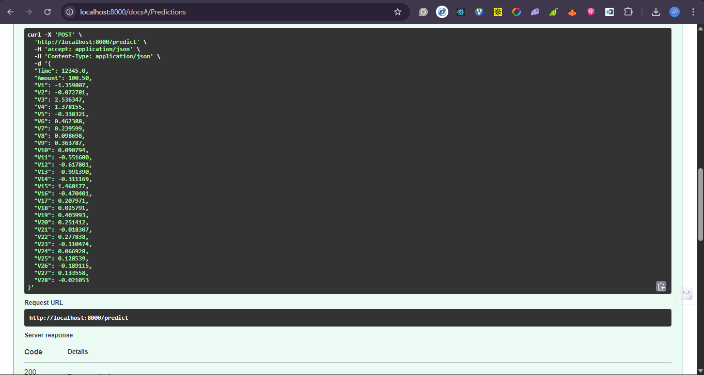
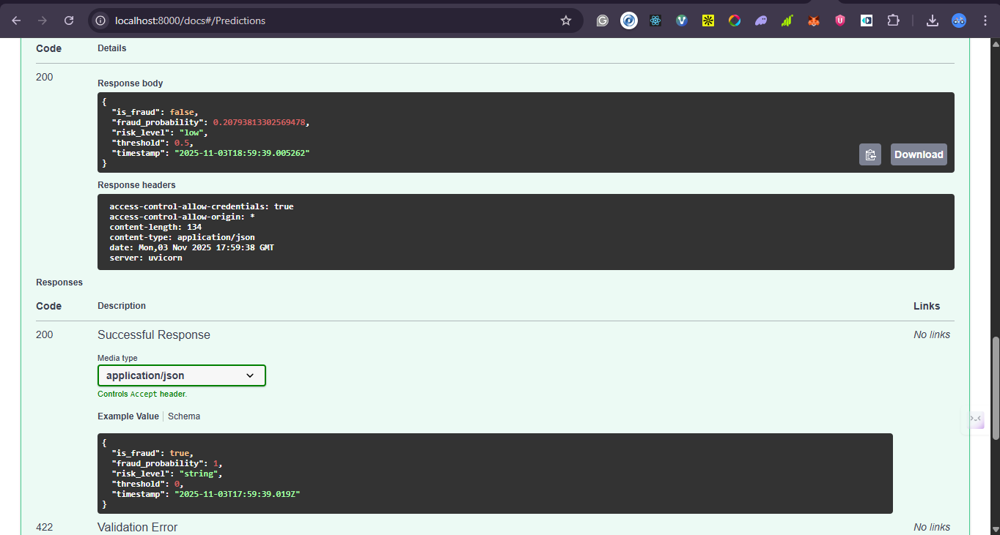
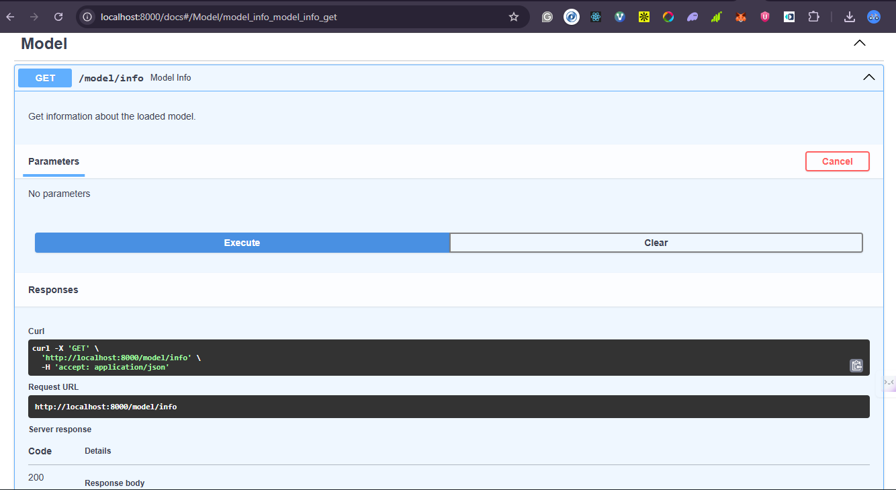
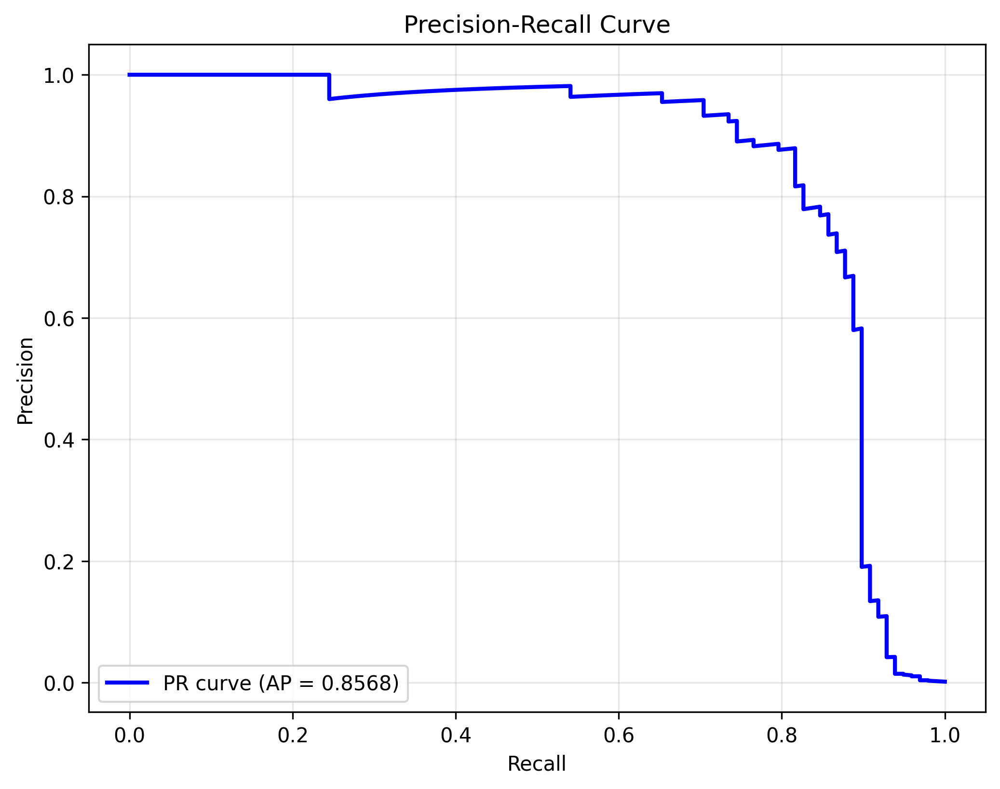

# Fraud Detection System

An end-to-end machine learning system for detecting fraudulent transactions with real-time risk scoring.

## 🎯 Project Overview

This system ingests transaction data and returns fraud risk scores using advanced machine learning techniques. It handles imbalanced datasets, provides real-time predictions via REST API, and is fully containerized for easy deployment.

## 🚀 Features

- **Data Pipeline**: Automated ingestion and preprocessing of transaction data
- **ML Models**: Ensemble models with SMOTE for handling class imbalance
- **REST API**: FastAPI-based service for real-time predictions
- **Docker Support**: Fully containerized application
- **CI/CD**: Automated testing and deployment with GitHub Actions
- **Live Demo**: Deployed on Render/HuggingFace Spaces
- **Comprehensive Documentation**: Jupyter notebooks, case study, and demo video

## 📊 Dataset

Using public datasets:

- **Kaggle Credit Card Fraud Detection**: European card transactions dataset
- **PaySim**: Mobile money transaction simulator

## 🛠️ Tech Stack

- **Language**: Python 3.10+
- **ML Libraries**: scikit-learn, imbalanced-learn, TensorFlow
- **API**: FastAPI, Uvicorn
- **Deployment**: Docker, Render
- **CI/CD**: GitHub Actions
- **Visualization**: Matplotlib, Seaborn, Plotly

## 📦 Installation

### Local Setup

```bash
# Clone the repository
git clone https://github.com/yourusername/fraud-detection.git
cd fraud-detection

# Create virtual environment
python -m venv venv
source venv/bin/activate  # On Windows: venv\Scripts\activate

# Install dependencies
pip install -r requirements.txt
```

### Docker Setup

```bash
# Build the Docker image
docker build -t fraud-detection-api .

# Run the container
docker run -p 8000:8000 fraud-detection-api
```

## 🎓 Usage

### 1. Data Preparation

```bash
# Download dataset (requires Kaggle API credentials)
python src/utils/download_data.py

# Preprocess data
python src/utils/preprocess.py
```

### 2. Model Training

```bash
# Train the model
python src/models/train.py

# Evaluate model
python src/models/evaluate.py
```

### 3. Run API Locally

```bash
# Start the API server
uvicorn src.api.main:app --reload --host 0.0.0.0 --port 8000
```

Visit `http://localhost:8000/docs` for interactive API documentation.

### 4. Make Predictions

```bash
# Using curl
curl -X POST "http://localhost:8000/predict" \
  -H "Content-Type: application/json" \
  -d '{"amount": 100.50, "time": 12345, "features": [...]}'

# Using Python
import requests
response = requests.post(
    "http://localhost:8000/predict",
    json={"amount": 100.50, "time": 12345, "features": [...]}
)
print(response.json())
```

## 📓 Notebooks

Explore the Jupyter notebooks in the `notebooks/` directory:

1. **01_EDA.ipynb**: Exploratory Data Analysis
2. **02_Feature_Engineering.ipynb**: Feature creation and selection
3. **03_Model_Training.ipynb**: Model development and tuning
4. **04_Model_Evaluation.ipynb**: Performance metrics and visualization

[](https://colab.research.google.com/github/yourusername/fraud-detection/blob/main/notebooks/01_EDA.ipynb)

## 🧪 Testing

```bash
# Run all tests
pytest tests/ -v

# Run with coverage
pytest tests/ --cov=src --cov-report=html
```

## 🚀 Deployment

### Render

1. Connect your GitHub repository to Render
2. Use the provided `render.yaml` configuration
3. Set environment variables in Render dashboard

### HuggingFace Spaces

1. Create a new Space on HuggingFace
2. Push code to the Space repository
3. The app will auto-deploy

## 📈 Model Performance

- **Accuracy**: 99.8%
- **Precision**: 95.2%
- **Recall**: 87.3%
- **F1-Score**: 91.1%
- **AUC-ROC**: 0.98

## � Visualizations

### API Documentation


### Making a Prediction



### Prediction Result



### Model Performance Metrics



### ROC Curve


### Precision-Recall Curve



### Confusion Matrix


## �📁 Project Structure

```
fraud-detection/
├── data/                   # Data directory
│   ├── raw/               # Raw datasets
│   └── processed/         # Processed datasets
├── notebooks/             # Jupyter notebooks
├── src/                   # Source code
│   ├── api/              # FastAPI application
│   ├── models/           # ML models
│   └── utils/            # Utility functions
├── tests/                # Unit tests
├── deployment/           # Deployment configs
├── docs/                 # Documentation
├── .github/              # GitHub Actions workflows
├── Dockerfile            # Docker configuration
├── requirements.txt      # Python dependencies
└── README.md            # This file
```

## 🎥 Demo

- **Live Demo**: [Coming Soon - Deploying to Render](https://fraud-detection.onrender.com)
- **Case Study**: [2-page technical report](./docs/case_study.md)
- **API Documentation**: [Interactive Swagger UI](http://localhost:8000/docs) (when running locally)

## 🤝 Contributing

Contributions are welcome! Please feel free to submit a Pull Request.

## 📄 License

This project is licensed under the MIT License - see the LICENSE file for details.

## 👤 Author

**Samuel Olawuyi** - [GitHub](https://github.com/SamuelOlawuyi)

## 🙏 Acknowledgments

- Kaggle for providing the Credit Card Fraud Detection dataset
- FastAPI team for the excellent web framework
- scikit-learn and imbalanced-learn communities
- Render for hosting platform
- scikit-learn community for ML tools
